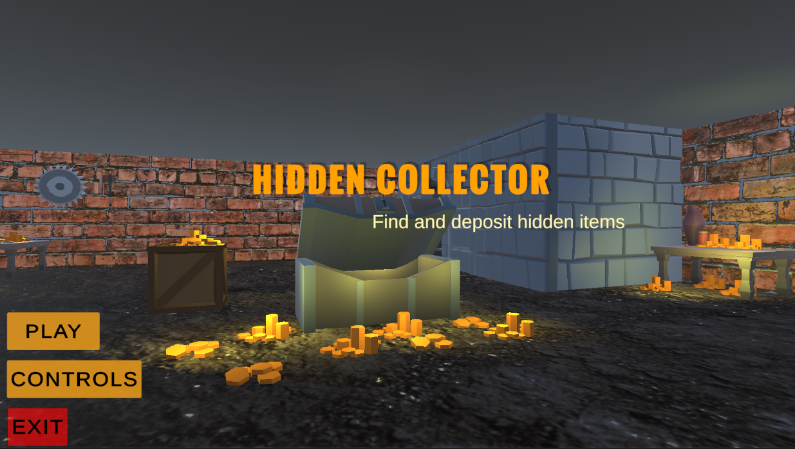
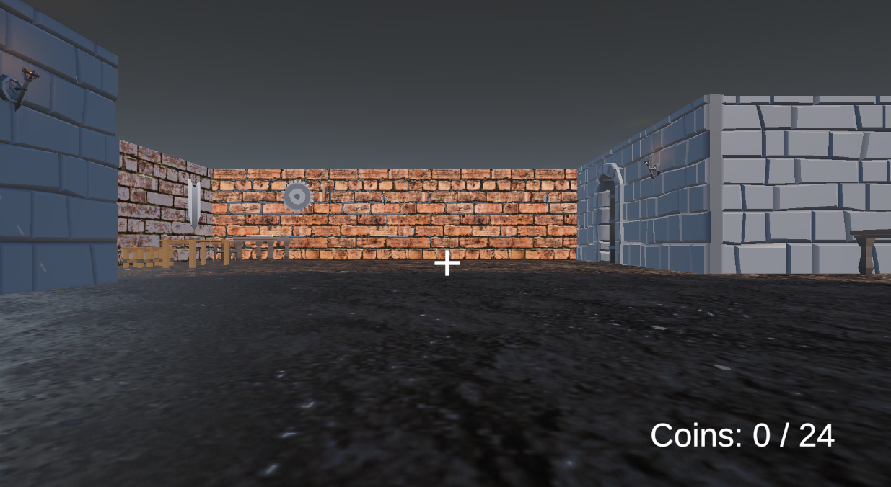
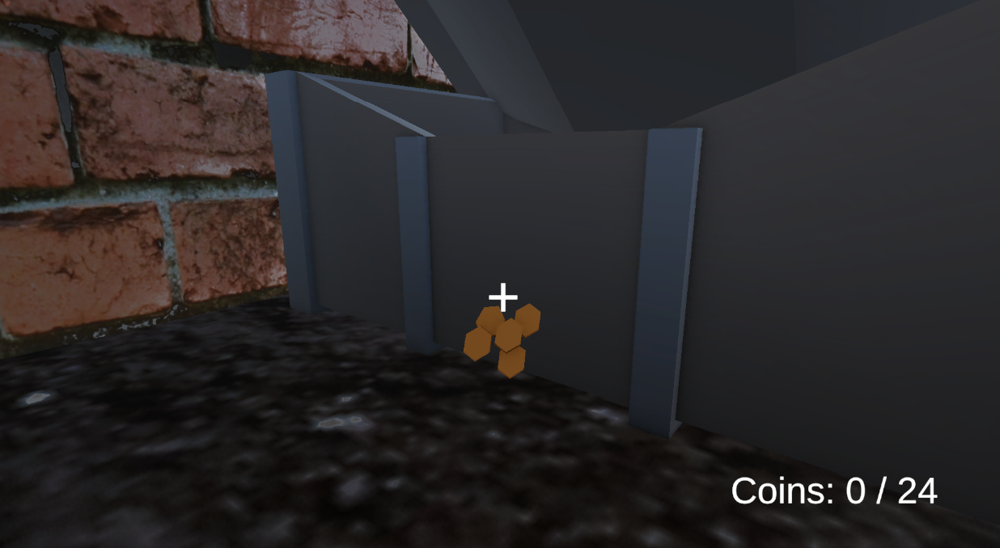
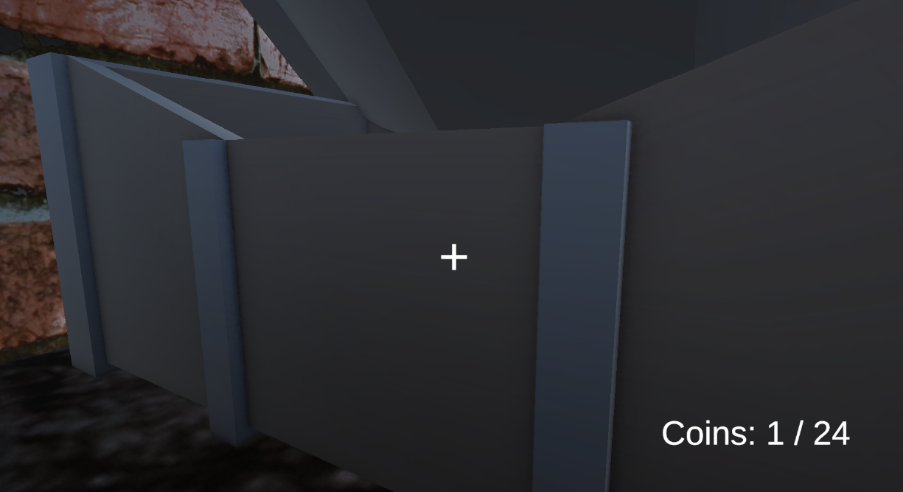
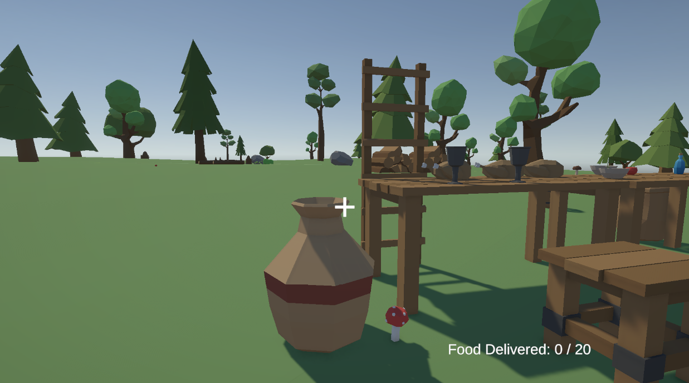
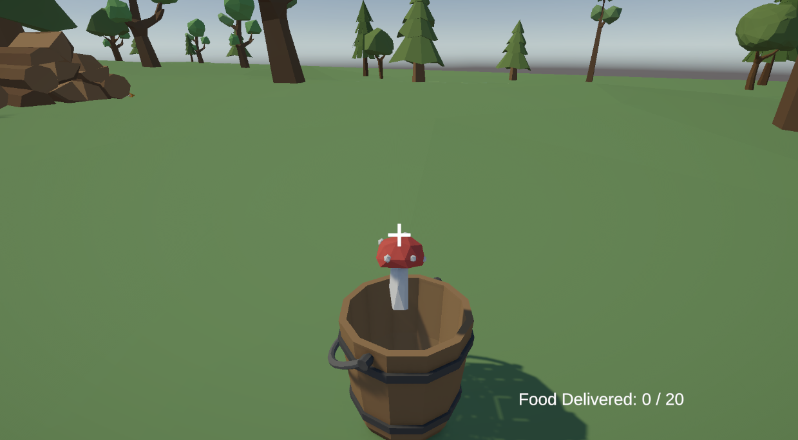

# 🎮 Collector Game

A Unity-based 3D collector game built with C#. Players explore levels, collect items, complete objectives, and progress through interactive environments.

## ✨ Features

- Player movement system
- Collectible item mechanics
- Multiple game levels
- Main menu system
- Collision & trigger interactions
- Score/objective progression
- Built with Unity and C#

## 🛠 Tech Stack

- Unity
- C#
- Visual Studio

## 📷 Screenshots

### Main Menu


### Level 1


### Level 1 Coins


### Level 1 Deposit System


### Level 2


### Level 2 Food Collection


## 🚀 How to Run

1. Clone the repository

```bash
git clone https://github.com/sinxcos07/collector-game.git
```

2. Open the project in Unity

3. Open the main scene

4. Press ▶ Play

## 🎯 Gameplay

Navigate through the game world, collect objects, complete objectives, and progress through different levels.

## 📚 What I Learned

- Unity game development workflow
- C# scripting
- Scene management
- Collision & trigger systems
- Game mechanics implementation
- UI handling

## 🔮 Future Improvements

- Add enemy AI
- More levels
- Sound effects
- Better UI
- Power-ups and collectibles

## 👨‍💻 Author

Made by Suryansh Sinha - Sinxcos07
